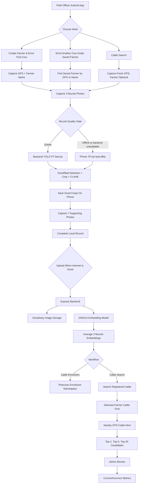

# Vacapay Muzzle App Architecture And Metrics

This document explains the full Vacapay Muzzle field-testing system: what the app does, how the field officer flow works, how images become embeddings, how Pinecone search works, and how admin accuracy metrics are calculated.

## 1. Base Concept

Vacapay Muzzle is a field-testing app for cattle identity verification using muzzle patterns.

The idea is simple:

```text
A cow muzzle has a repeatable skin pattern.
If we capture clean muzzle crops, convert them into embeddings, and compare those embeddings,
the app can test whether a cow is already registered.
```

The app is not only an enrolment app. It is mainly for real field testing of the model.

The field test has two separate workflows:

```text
Cattle Enrolment  -> creates registered cattle identities
Cattle Search     -> tests whether a captured cow matches registered cattle
```

Important rule:

```text
Enrol each cow only once.
When the same cow is photographed again, use Cattle Search.
Cattle Search must never automatically create a registered cow.
```

## 2. Complete System Diagram



## 3. Main Components

### Field Android App

The field app is the guided capture surface for field officers.

It handles:

```text
agent login
farmer creation
farmer search by downloaded offline data
fresh GPS capture
3 muzzle captures
7 supporting captures
offline local storage
manual/retry upload
```

The app stores pending records on the phone first. Upload is separate so poor field internet does not break capture.

### Admin Dashboard

The admin dashboard is for verification and reporting.

It handles:

```text
registered cattle inventory
cattle grouped by officer and farmer
cattle search review
query images versus candidate images
Top-5 visual comparison
Top-20 ranked list
correct/incorrect review decisions
field-test accuracy metrics
CSV export
```

### Backend

The backend is the processing and storage API.

It handles:

```text
login and JWT auth
role-based access
record creation
image upload
backend YOLO PT muzzle check when online
DINOv2 embedding generation
Pinecone vector upsert/query
MongoDB metadata persistence
Cloudinary image storage
admin review updates
```

## 4. Image Capture Flow

Each complete field record needs:

```text
3 muzzle images
7 supporting images
```

Muzzle images:

```text
muzzle1.jpg
muzzle2.jpg
muzzle3.jpg
```

Supporting images:

```text
face1.jpg
face2.jpg
face3.jpg
leftside.jpg
rightside.jpg
back.jpg
udder.jpg
```

Only muzzle crops are used for embeddings. Supporting images are for admin human verification.
All seven supporting views are mandatory; the UI cannot skip a required view.

## 5. Muzzle Quality Gate

The muzzle gate decides whether a camera frame is useful for embedding.

Current classes:

```text
goodmuzzle
bad muzzle
```

Current thresholds:

```text
minimum good muzzle confidence: 0.50
minimum bad muzzle confidence: 0.45
bad dominance margin: 0.12
minimum sharpness score: 18
```

### Online Behavior

When the app has internet and backend is reachable, the app tries backend muzzle checking first:

```text
camera frame
-> /api/muzzle/check
-> backend/scripts/yolo_pt_muzzle_check.py
-> backend/best.pt
-> good/bad detection
-> crop selected muzzle box
-> CLAHE contrast enhancement
-> return cropBase64 to phone
```

The backend response source is:

```text
backend_yolo_pt
```

### Offline Or Backend-Fallback Behavior

If the backend check times out or the phone is offline, the app uses the phone model:

```text
frontend/src/assets/models/best.tflite
```

The phone still rejects bad/blurry muzzles and saves only accepted crops.

### Why Backend PT And Phone TFLite Both Exist

```text
backend/best.pt       -> easier to test/update server-side when internet is available
phone best.tflite     -> keeps field capture working when internet is weak or absent
```

Important trade-off:

```text
PyTorch .pt is heavier than TFLite.
If the backend starts a new Python process for every frame, backend checking can be slower.
For production speed, the next improvement is a persistent Python model service that keeps best.pt loaded once.
```

## 6. Backend Embedding Flow

After upload, the backend checks that all required muzzle files exist:

```text
muzzle1.jpg
muzzle2.jpg
muzzle3.jpg
```

Then it runs the DINOv2 embedding script:

```text
backend/scripts/embedding_average.py
```

The model file is:

```text
backend/dinov2_triplet_v2_best.pt
```

Embedding process:

```text
muzzle1.jpg -> embedding 1
muzzle2.jpg -> embedding 2
muzzle3.jpg -> embedding 3
average embedding = mean(embedding1, embedding2, embedding3)
final average embedding is L2-normalized
```

Why average 3 embeddings:

```text
one image may have small lighting, angle, blur or crop variation
three accepted crops give a more stable representation of the same cow
```

Bad captures should not enter this average. That is why good/bad and blur checks happen before upload or before embedding.

## 7. Pinecone Storage

The app keeps registered cattle and search evidence separate.

```text
PINECONE_ENROLMENT_NAMESPACE = vacapay-cattle-enrolment
PINECONE_SEARCH_NAMESPACE    = vacapay-cattle-search
```

### Enrolment Namespace

Stores clean registered cattle identities.

Used as the searchable gallery.

### Search Namespace

Stores cattle search evidence.

Not used as the main registered cattle gallery.

This prevents field-test search captures from polluting the registered cattle database.

## 8. Cattle Enrolment Flow

Use enrolment only for a new cow.

```text
agent chooses Create Farmer & Enrol First Cow, or Enrol Another Cow
agent captures GPS and farmer details
agent captures 3 good muzzle photos
agent captures 7 supporting photos
record uploads to backend
backend creates 3 embeddings and averages them
backend checks if this cow already exists
```

If the backend finds a strong existing match during enrolment:

```text
enrolment duplicate is blocked/warned
registered cattle is not duplicated automatically
admin can review whether it is truly the same cow or a different cow
```

If no match is found:

```text
record becomes registered cattle
average embedding is saved in Pinecone enrolment namespace
future cattle searches can match against it
```

## 9. Cattle Search Flow

Use Cattle Search for testing.

```text
agent chooses Cattle Search
app captures fresh GPS
agent may select farmer by GPS/name, but farmer is optional
agent captures same 3 muzzle + 7 supporting image set
backend creates a search embedding
backend compares only against registered cattle
search result is saved for admin review
```

Cattle Search result can be:

```text
Cattle Found
No Cattle Found
```

Backend decision names:

```text
matched_existing -> Cattle Found
new_cattle        -> No Cattle Found
```

Important:

```text
Cattle Search never creates registered cattle automatically.
Even if the result is No Cattle Found, it remains a search record until admin decides what it means.
```

## 10. Search Order

When a farmer is selected:

```text
1. Search selected farmer cattle first.
2. If no selected-farmer match reaches threshold, search nearby registered cattle by GPS radius.
```

When no farmer is selected:

```text
1. Search nearby registered cattle by captured GPS radius.
```

Current match threshold:

```text
EMBEDDING_MATCH_THRESHOLD = 0.70
70% and above is treated as a match candidate for automatic Cattle Found.
```

Candidate source labels:

```text
farmer_cattle    -> candidate belongs to selected farmer
nearby_location  -> candidate is inside the configured GPS radius
outside_location -> returned by broad Pinecone query but not eligible for automatic search match
all_other_muzzle -> legacy/admin label for older records
```

The app keeps one best candidate per cattle identity before Top-K display. This prevents one cow with multiple captures from filling multiple Top-5 positions.

## 11. What Scores Mean

### Muzzle Confidence

This comes from the YOLO good/bad muzzle detector.

Example:

```text
goodmuzzle 0.86 = YOLO thinks the detected crop is a good muzzle with 86% confidence
```

This is only a capture-quality score. It does not identify the cow.

### Sharpness Score

This is a blur/edge score calculated on the muzzle crop.

```text
sharpness < 18 -> reject as blurry
sharpness >= 18 -> allow if muzzle class is good
```

This is also only a quality score.

### Embedding Match Score

This is the similarity between two DINOv2 embeddings.

```text
query average embedding compared with registered cattle average embedding
higher score means more similar muzzle pattern
```

In the app this is shown as confidence percent:

```text
score 0.87 -> 87%
score 0.70 -> threshold-level match
score below 0.70 -> not accepted as automatic Cattle Found
```

## 12. Admin Review Is Ground Truth

The model gives a prediction. Admin review decides correctness.

Admin reviews each Cattle Search as one of:

```text
Cattle found correct
Cattle found incorrect
No cattle found correct
No cattle found incorrect
```

Meaning:

```text
Cattle found correct      -> app found the right registered cow
Cattle found incorrect    -> app matched the wrong cow
No cattle found correct   -> the cow was really not registered
No cattle found incorrect -> the cow existed, but the app missed it
```

If the app says a newly enrolled cow is duplicate during enrolment, that is handled separately as a duplicate-block review. It should not be confused with a normal Cattle Search unless admin marks it as part of review.

## 13. Accuracy And Metrics

The admin dashboard calculates metrics from review records.

### Total Cattle Enrolled

```text
count of clean registered cattle identities
```

Search records are not counted here.

### Total Cattle Searches

```text
count of workflow=cattle_search review records
```

### Reviewed Searches

```text
cattle searches where admin has selected a final correct/incorrect status
```

### Cattle Found Results

```text
count where app decision = matched_existing
```

### No Cattle Found Results

```text
count where app decision = new_cattle
```

### Correct/Incorrect Found Metrics

```text
cattle found correct   = reviewed searches marked found_correct, or matched expected cattle ID
cattle found incorrect = reviewed searches marked found_incorrect or wrong_moved_to_registered, or matched a different expected cattle ID
```

### Correct/Incorrect No-Found Metrics

```text
no cattle found correct   = reviewed searches marked no_cattle_correct
no cattle found incorrect = reviewed searches marked no_cattle_incorrect, or expected cattle ID existed but app returned new_cattle
```

### Top-1 Accuracy

Top-1 accuracy is calculated only on reviewed searches where an expected enrolled cow exists and Top-K evaluation applies.

```text
Top-1 accuracy = reviewed searches where expected cattle ID is rank 1 / reviewed Top-K applicable searches
```

A correct new-cow / no-cattle-found result is excluded from Top-1 and Top-5 because there is no expected registered cattle ID.

### Top-5 Accuracy

```text
Top-5 accuracy = reviewed searches where expected cattle ID appears anywhere in first 5 candidates / reviewed Top-K applicable searches
```

### Officer Quality

Officer summary uses average embedding match score for that officer's searches:

```text
>= 85% -> Good
>= 70% -> Medium
< 70%  -> Needs work
```

This is a capture/model signal, not a final correctness label. Correctness still comes from admin review.

## 14. What Reduces Accuracy

Accuracy reduces when admin confirms the model was wrong.

Examples:

```text
App says Cattle Found, but admin sees it is a different cow -> cattle found incorrect
App says No Cattle Found, but admin finds the enrolled cow -> no cattle found incorrect / missed match
Expected cow is not rank 1 -> Top-1 fails
Expected cow is not in Top-5 -> Top-5 fails
```

A duplicate warning during enrolment does not automatically reduce Cattle Search accuracy. It affects accuracy only if admin review says the model result was wrong and records that correction.

## 15. Field Test Plan

Recommended field test per officer:

```text
50 cattle enrolments
50 cattle searches
```

The cattle searches should include:

```text
already enrolled cows -> expected result is Cattle Found
new cows not enrolled -> expected result is No Cattle Found
```

For 10 officers:

```text
500 cattle enrolments
500 cattle searches
```

## 16. Production Risks To Watch

### Backend Memory

DINOv2 and PyTorch YOLO are heavy. Small free hosts can fail with out-of-memory errors.

Recommended backend memory:

```text
minimum: 2 GB for light testing
better: 4 GB or more for stable testing
```

### Backend PT Latency

`backend/best.pt` is heavier than phone TFLite. A persistent Python service would be faster than spawning Python per request.
The online path checks the backend first and falls back to the phone for 30 seconds after a timeout/failure, avoiding
two serial model runs for every accepted image. Python subprocesses have a configurable hard timeout
(`PYTHON_PROCESS_TIMEOUT_MS`, default 180 seconds) so an upload cannot remain stuck forever.

### Offline Runtime

The phone TFLite model is required for real field offline capture. The field build copies the pinned TensorFlow JS runtime, WASM assets and `best.tflite` into the Capacitor Android APK, so the quality gate can run without internet.

### Data Separation

Do not merge Cattle Search records into registered cattle unless admin explicitly chooses that action. The clean enrolment namespace must stay clean.

### Duplicate Enrollment Gate Metric

Enrollment duplicate decisions are reported separately from Cattle Search Top-1/Top-5. If admin confirms the block,
the duplicate gate records a correct decision. If admin registers it as a different cow, the gate records a false block.
This correction does not alter the Cattle Search denominator.

## 17. One-Line Explanation For Demo

```text
The app enrols clean cattle identities, then field officers run separate cattle searches. Each search captures 3 good muzzle crops, averages DINOv2 embeddings, checks selected-farmer cattle first and nearby GPS cattle next, and admin reviews the Top-20 evidence to calculate correct/incorrect field accuracy.
```
